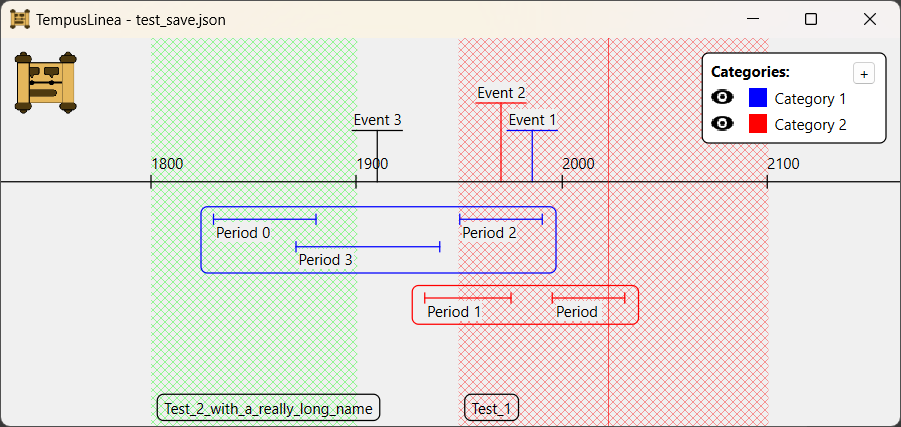

# TempusLinea

TempusLinea is a free and open source software aimed to create, edit and visualize timelines.

TempusLinea supports **events**, **time periods** and **eras** that can be grouped into **categories**.

Elements creation and editing is guided by interactive and user-friendly forms.